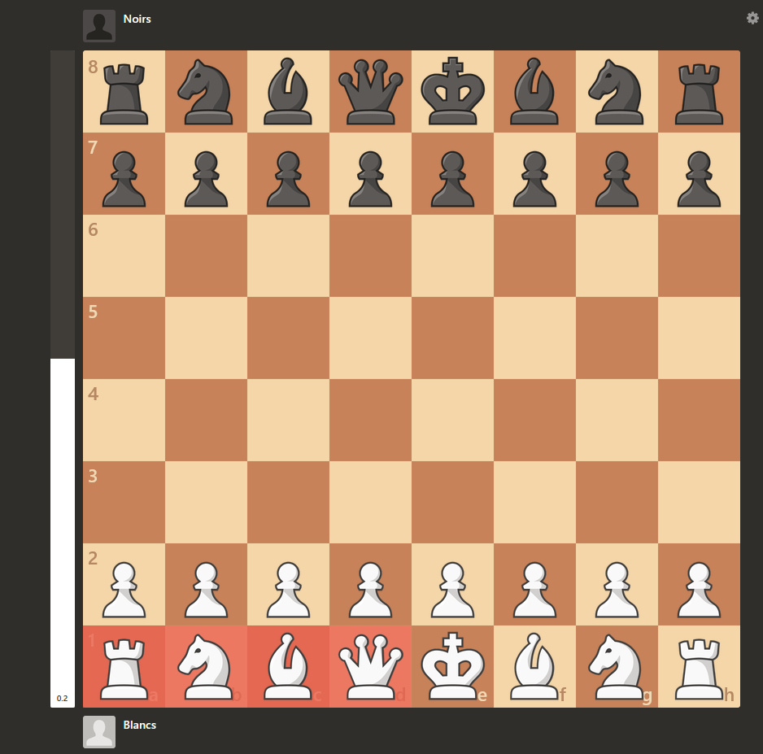

# Echiquier connecté

## Installation des packages

Installer les modules : conda env create -f environment.yml

## Fonctionnement du programme

### Cas de simulation sans le raspberry

Etant donné que nous n'avons pas eu accès aux capteurs nous avons beaucoup développé l'aspect simulation des inputs pour tester notre programme d'échecs.

Le fichier à exécuter est celui qui s'appelle `main.py`. Il est possible de modifier le FEN de départ. Une interface graphique s'ouvre et permet de visualiser la position des capteurs allumés, ainsi que la position des pièces enregistrée par l'ordinateur.

En cliquant sur les cases, on peut simuler l'allumage ou l'extinction d'un reed switch. Lorsque le programme détecte qu'un coup a été effectué (par exemple, soulèvement du pion en e2, puis posage sur pion en e4), il met à jour son échiquier interne et déplace la lettre du pion.

Le programme prend en charge le roque, la prise en passant, la promotion ainsi que les différentes façon de terminer la partie : échec et mat, pat, insuffisance de matériel, nulle par répétition, nulle par suite consécutive de 50 coups sans prise ni déplacement de pion.

#### Promotion

Lorsqu'un pion arrive sur la case de promotion, il faut le changer en une autre pièce. Pour indiquer quelle pièce on a choisi à l'ordinateur, nous avons décidé de demander au joueur de modifier l'état d'une case tampon.

Si une pièce est posée sur la case tampon, la pièce doit être soulevée puis reposée. Si aucune pièce n'est sur la case tampon, une pièce doit être posée puis reprise.

---

Attention, il faut bien penser que quand le pion est promu, il doit être remplacé par une autre pièce, et donc pour que l'ordinateur valide la promotion, la case du pion doit être désactivée puis réactivée pour simuler ce changement de pièce.